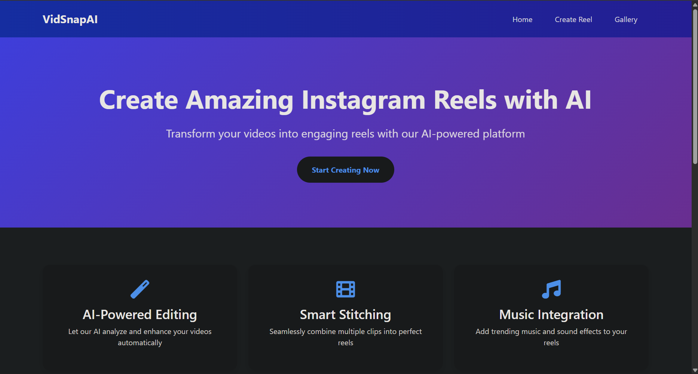
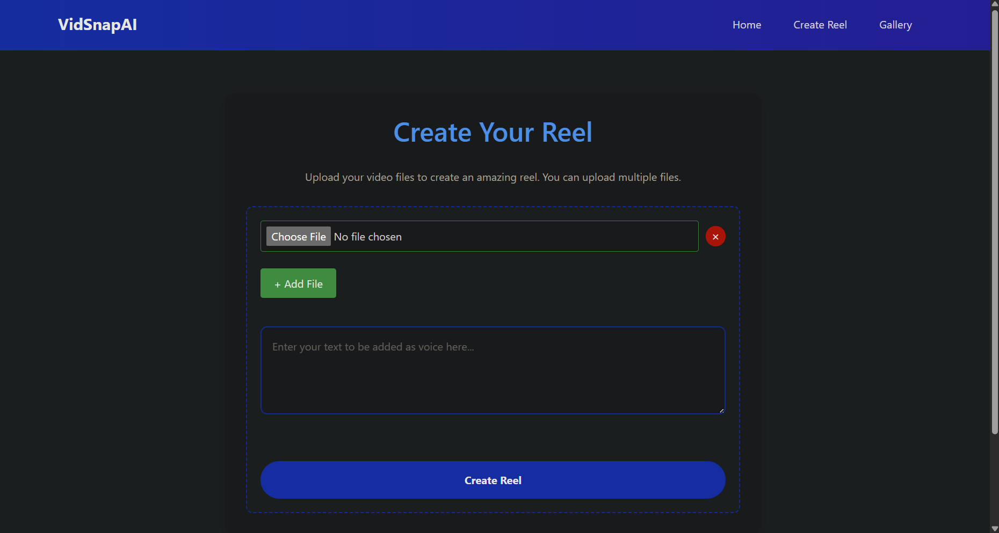
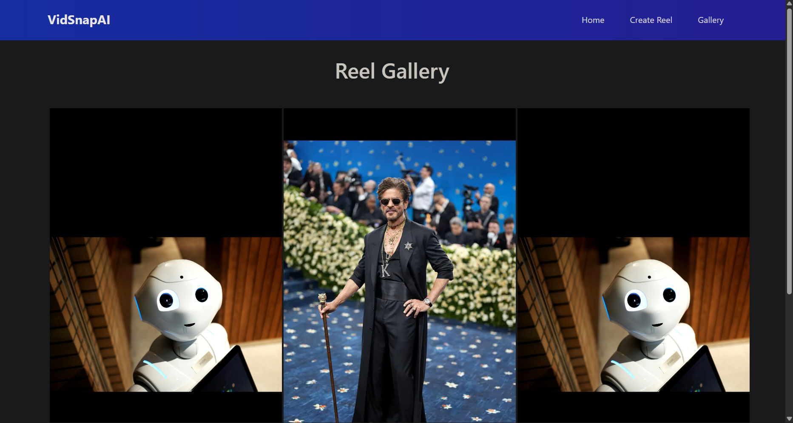

# 🎬 VidSnap AI

<p align="center">
  
</p>

<p align="center">
  <strong>Create AI-powered narrated slideshow videos from images and text.</strong>
</p>

<p align="center">
  
  
  
  
  
</p>

---

## 📖 Overview

VidSnap AI is a Flask-based web application that transforms a collection of images and a text script into an AI-narrated slideshow video.

The application generates realistic voice narration using the **ElevenLabs Text-to-Speech API**, automatically combines uploaded images into a slideshow using **FFmpeg**, and produces a ready-to-share MP4 video.

---

## ✨ Features

- 📸 Upload multiple images
- 📝 Add a narration script
- 🗣️ AI-generated voice using ElevenLabs
- 🎞️ Automatic slideshow generation
- 🎥 MP4 video rendering with FFmpeg
- 📂 Unique upload folder for every project
- 🖼️ Gallery page to view generated reels
- 🌐 Clean and responsive Flask interface

---

# 📸 Screenshots

## Home Page

<p align="center">

</p>

---

## Create Reel

<p align="center">

</p>

---

## Gallery

<p align="center">

</p>

---

## ⚙️ Workflow

```text
Upload Images + Script
          │
          ▼
      Flask Backend
          │
          ▼
 Stores Images & Script
          │
          ▼
 Background Worker
(generate_process.py)
          │
          ▼
 Generate AI Narration
    (ElevenLabs API)
          │
          ▼
 Create Slideshow
      (FFmpeg)
          │
          ▼
 Save Final MP4
(static/reels)
          │
          ▼
 View in Gallery
```

---

# 🛠️ Tech Stack

### Backend

- Python
- Flask

### AI

- ElevenLabs Text-to-Speech API

### Video Processing

- FFmpeg

### Frontend

- HTML
- CSS
- JavaScript

### Python Libraries

- Werkzeug
- UUID
- Subprocess
- OS

---

# 📂 Project Structure

```text
VidSnap-AI/
│
├── demo/
│   └── sample_output.mp4
│
├── images/
│   ├── home.png
│   ├── create_reel.png
│   └── gallery.png
│
├── sample_images/
├── static/
│   ├── css/
│   └── reels/
│
├── templates/
│   ├── base.html
│   ├── create.html
│   ├── gallery.html
│   └── index.html
│
├── user_uploads/
│
├── main.py
├── generate_process.py
├── text_to_audio.py
├── config.py
├── requirements.txt
├── README.md
└── LICENSE
```

---

# 🚀 Installation

Clone the repository

```bash
git clone https://github.com/kohli30/VidSnap-AI.git
```

Move into the project

```bash
cd VidSnap-AI
```

Install dependencies

```bash
pip install -r requirements.txt
```

Install FFmpeg and ensure it is available in your system PATH.

Add your ElevenLabs API key inside `config.py`.

---

# ▶️ Running the Application

This project uses **two Python processes**.

### Terminal 1

Run the Flask application.

```bash
python main.py
```

### Terminal 2

Run the background processing worker.

```bash
python generate_process.py
```

Now open your browser.

```
http://127.0.0.1:5000
```

---

# 🎥 Usage

1. Start both Python programs.
2. Open the web application.
3. Navigate to **Create Reel**.
4. Upload multiple images.
5. Enter the narration script.
6. Click **Create Reel**.
7. The background worker:
   - Detects the uploaded project
   - Converts the script into AI narration
   - Generates a slideshow
   - Renders the final MP4 video
8. Open the **Gallery** page to view generated reels.

---

# 🔄 Processing Pipeline

## Flask (`main.py`)

- Receives uploaded images
- Stores images in a unique UUID folder
- Saves narration text
- Generates FFmpeg input list

---

## Background Worker (`generate_process.py`)

- Continuously monitors the upload folder
- Detects new projects
- Calls the text-to-speech module
- Executes FFmpeg
- Saves completed videos
- Tracks processed folders using `done.txt`

---

## Text-to-Speech (`text_to_audio.py`)

- Connects to the ElevenLabs API
- Generates realistic AI narration
- Saves narration as `audio.mp3`

---

# 💡 Future Improvements

- 🎵 Background music support
- 🎨 Image transition effects
- 📝 Automatic subtitle generation
- 🌍 Multi-language narration
- 🎬 Video preview before download
- 📊 Rendering progress indicator
- ☁️ Cloud deployment
- 🤖 AI-generated scripts from prompts

---

# 👨‍💻 Author

**Aditya Kohli**

- GitHub: https://github.com/kohli30
- LinkedIn: https://www.linkedin.com/in/aditya-k-b3812928b/

---

## 📄 License

This project is licensed under the MIT License.

---

## ⭐ Support

If you found this project useful, consider giving it a ⭐ on GitHub!
